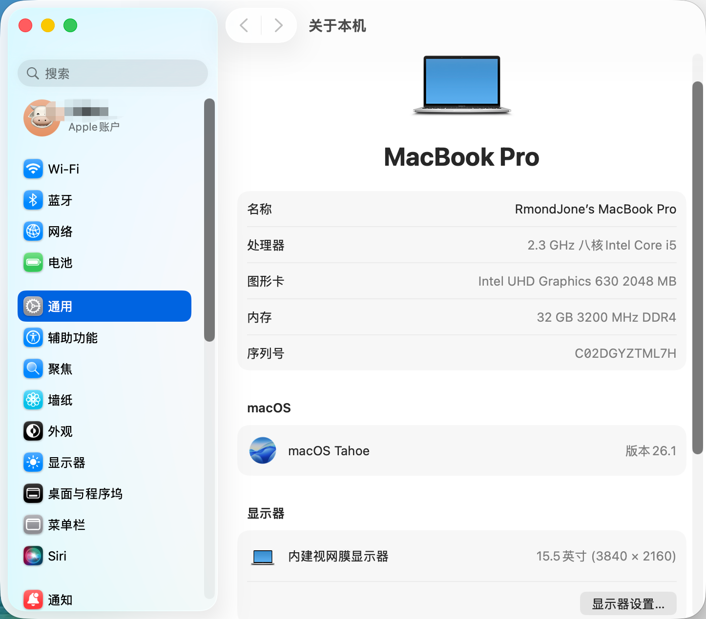
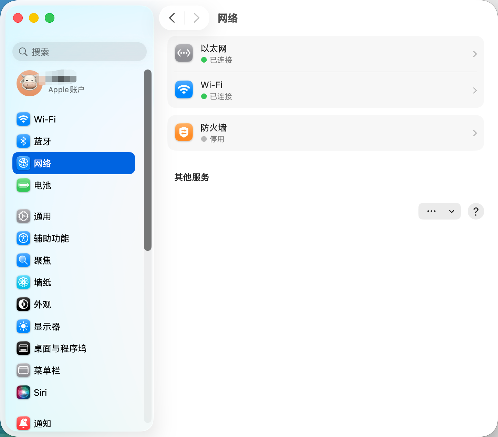
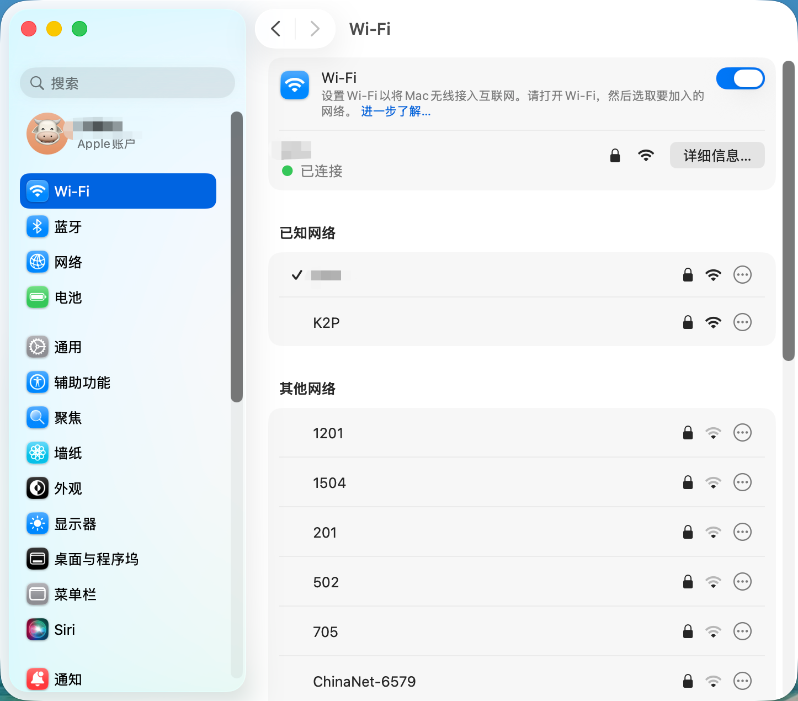
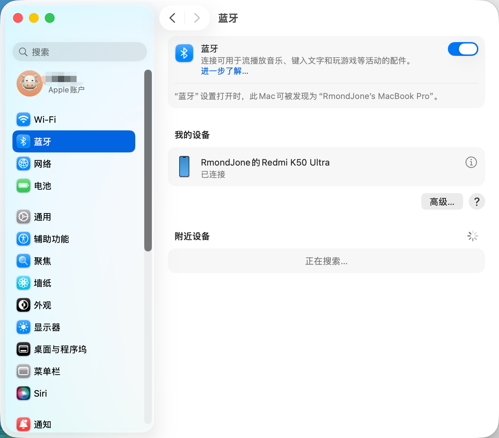
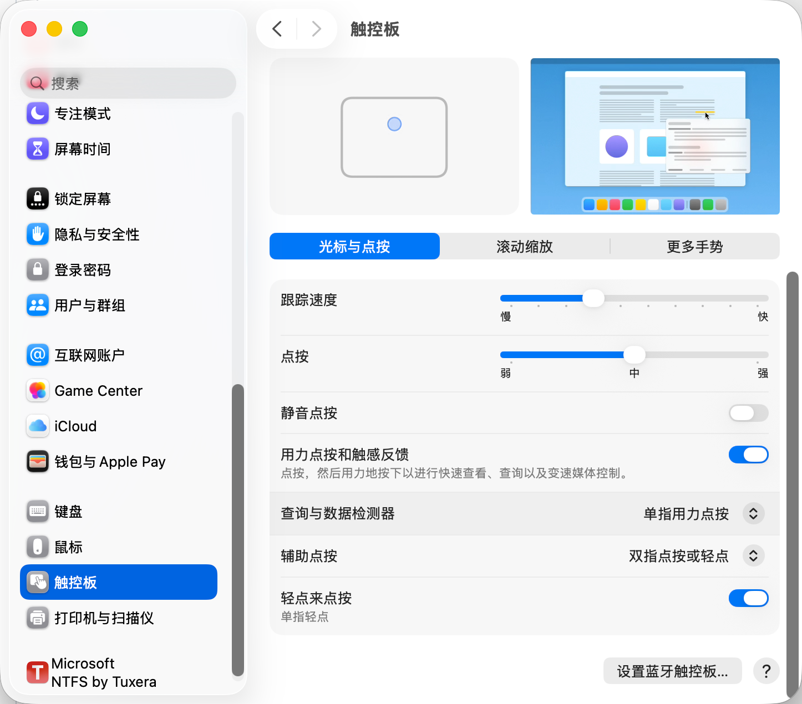

# ROG-Zephyrus-M15-Hackintosh-GU502LW
ROG 玩家国度  幻15（GU502LW）黑苹果 EFI配置文件

### 一、 硬件配置

配置|名称
--|--
CPU|i7-10875H
显卡|Graphics UHD 630
硬盘|西部数据 1T SSD+西部数据 1T SSD
内存|DDR4 16GB*2
声卡|板载ALC294
有线网卡| Realtek RTL8168
无线网卡&蓝牙| Intel Wireless AX201

### 二、黑苹果完美成果以及现状

环境|版本
--|--
OpenCore|1.0.5
MacOS Tahoe|26.1

✨已驱动：

* 核显完美(显存已改为2G)
* 声卡完美
* 网卡：有线+无线完美 (OCLP)
* 蓝牙完美
* 隔空投送功能正常
* 睡眠正常
* 电池管理完美
* 触摸板完美
* CPU、温度传感器正常
* CPU变频正常
* 声音调节快捷键正常

### GitHub
EFI地址：[https://github.com/RmondJone/ROG-Zephyrus-M15-Hackintosh-GU502LW](https://github.com/RmondJone/ROG-Zephyrus-M15-Hackintosh-GU502LW)

